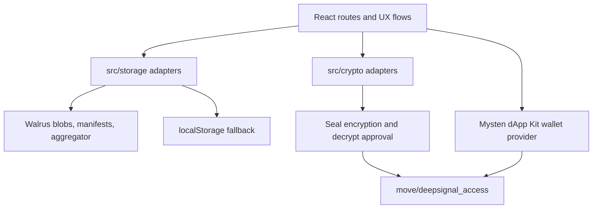

# DeepSignal

**Encrypted signal infrastructure built on Walrus.**

DeepSignal is a Walrus-native feedback and forms MVP for teams that need to collect high-value product signals without turning private user context into another centralized database liability.

It looks like a simple signal form from the outside: share a link or QR code, let anyone respond without a wallet, and keep the response flow fast. Under the hood, DeepSignal stores forms, submissions, manifests, and recovery indexes through Walrus; protects private submissions with Seal; and uses Sui/Move access control for creator, admin, and reviewer workflows.

The result is not a generic form builder. DeepSignal is an **Encrypted Signal Inbox**: a review surface where private feedback can be submitted, recovered, decrypted by authorized wallets, triaged into roadmap work, and exported when the team is ready to act.

## Why DeepSignal Exists

Product teams ask users for their most useful context: bugs, pain points, screenshots, roadmap requests, deal blockers, complaints, and sometimes sensitive operational details. The current feedback stack usually forces a bad tradeoff:

- keep response friction low, but centralize private data in a SaaS database;
- require wallets or accounts, but lose the people whose feedback matters most;
- publish public roadmaps, but blur the line between safe metadata and private payloads.

DeepSignal keeps those concerns separate.

Responders stay wallet-optional. Creators and reviewers use wallets only where authority matters: publishing, reviewing, decrypting, and managing access. Walrus carries the data layer, Seal protects private payloads, and Sui makes review rights explicit enough to become future protocol tooling instead of an app-only permission table.

## Core Flow

```mermaid
flowchart LR
  A["Creator drafts a signal form"] --> B["Publish to Walrus"]
  B --> C["Share public link or QR"]
  C --> D["Responder submits without wallet"]
  D --> E["Submission stored on Walrus"]
  E --> F["Seal-encrypted private payload"]
  F --> G["Encrypted Signal Inbox"]
  G --> H["Authorized wallet unlocks"]
  H --> I["Triage, roadmap, export"]
```



1. A creator starts with a **guest draft**, so form design does not require immediate wallet setup.
2. Publishing writes the form through the storage adapter and produces shareable links, QR sharing, and a Walrus manifest/recovery path.
3. Responders open `/f/:formId` and submit signals without connecting a wallet.
4. Sensitive or full private submissions are Seal-encrypted before they become reviewable payloads.
5. Creators/admins open the **Encrypted Signal Inbox**, unlock private signals with an authorized wallet, triage them, and choose which safe metadata can appear on the public roadmap.

## What Makes DeepSignal Different

**Wallet-optional where it matters.**  
Public response routes, roadmap viewers, and restore flows stay accessible without a wallet. DeepSignal does not turn feedback collection into an onboarding tax.

**Walrus is the storage layer, not a badge.**  
Forms, submissions, attachments, encrypted payload references, blob indexes, and manifest recovery are modeled around Walrus blob storage. The UI surfaces blob IDs, manifest links, and verification paths so judges and operators can see the data path.

**Private feedback is reviewable without becoming public.**  
Seal protects sensitive submissions, while the inbox still supports triage status, priority, tags, notes, signal value, GitHub links, roadmap stage, JSON export, and CSV export.

**Manifests are recovery indexes, not secret stores.**  
Walrus manifests let an operator recover the form/submission graph from blob references. They intentionally avoid private answer bodies, attachment names, owner addresses, tags, notes, and encrypted payload contents. The current manifest also carries safe form presentation metadata such as header image/logo so recovered public links can rebuild the expected shell without exposing submission secrets.

**Recovery state is mobile-safe metadata.**  
Public draft recovery stores only lightweight answers, current recovery counters, timestamps, diagnostics, and remote Walrus attachment references. It must not persist `File`/`Blob` objects, Base64 attachment bodies, encrypted attachment payloads, or full encrypted submission envelopes in `localStorage` or IndexedDB. Attachments are uploaded to Walrus when selected; recovery keeps the returned blob reference.

**Roadmaps are derived from review decisions.**  
The public roadmap only exposes selected `planned`, `in_progress`, and `fixed` signals, and encrypted roadmap entries show safe metadata only.

## Review Flow

This is the fastest path through the current UX.

1. Run the app and open the landing page.
2. Choose **Create signal** and build a form as a guest draft.
3. Enable private/encrypted collection if the demo environment has Seal configured.
4. Publish the form. The publish overlay shows the public link, QR code, Walrus status, and manifest/recovery link.
5. Open the public link or scan the QR code. Submit a response from `/f/:formId` without connecting a wallet.
6. Return to `/admin` or `/dashboard` and open the **Encrypted Signal Inbox**.
7. Inspect Walrus metadata and Seal status in the review flow.
8. If the submission is private, connect an authorized creator/admin/reviewer wallet and unlock it through Seal.
9. Triage the signal, set priority/tags/notes, assign roadmap stage, and export JSON or CSV.
10. Open `/explore` or `/roadmap/:formId` and confirm that public views contain only selected roadmap-safe metadata.

## Demo Flow Status

- The repo includes seeded demo data, fixture tooling, and a hidden Secure Signal Operations workspace path used for local judging rehearsals.
- The active app build does not currently expose a dedicated `/demo` route or a visible guided demo panel by default.
- For the current UI, the most reliable demo path is: create a guest draft, publish it, answer through `/f/:formId`, then review and decrypt in `/admin` or `/dashboard`.
- Demo-oriented seed helpers still exist for the inbox and insights workflows, but they should be treated as operator tooling rather than primary product navigation.

## Why Walrus / Seal / Sui

| Layer | Why DeepSignal Uses It |
| --- | --- |
| **Walrus** | Feedback data needs durable, addressable storage that can be verified outside the app. Walrus stores forms, submissions, encrypted payload blobs, attachments, blob indexes, and manifests. |
| **Seal** | Private submissions should fail closed when encryption is required. Seal lets DeepSignal encrypt sensitive payloads and require wallet/session approval before review. |
| **Sui** | Creator/admin/reviewer authority should be portable and extensible. The Move package models owner, admin, reviewer, project, form, and signal approval paths for future protocol-grade access policy. |

DeepSignal still preserves local fallback behavior. If Walrus is not configured, the app can run in `localStorage` mode for development and recovery scenarios. If a runtime Walrus write fails, the app saves locally and tells the user. Encryption is stricter: when protected submissions require Seal and encryption is unavailable, DeepSignal does not silently save plaintext private data.

## Contest Fit / Why Walrus

DeepSignal is designed for the Walrus track because the product only makes sense when storage is content-addressed, recoverable, and inspectable.

Walrus is used for:

- form definition blobs;
- submission blobs;
- encrypted payload blob references;
- attachment storage;
- blob-index behavior for app lookup;
- manifest blobs for recovery;
- aggregator links and blob IDs surfaced in the product flow.

The Walrus manifest design is especially important. A manifest is a recovery map that lets an operator rebuild the local admin cache from Walrus references, while keeping sensitive payload data out of the public recovery index. That makes DeepSignal feel less like a Web2 form app with a storage plugin and more like early infrastructure for encrypted, recoverable feedback networks.

## Product Surface

### Create

- Primary create route at `/create`, with admin alias at `/admin/forms/new`.
- Guest draft form builder is the default when no eligible creator wallet is connected.
- Field types include ratings, screenshots, videos, voice answers, rich text, matrix/checklist inputs, and sensitive answers.
- Publish overlay with public link, QR sharing, Walrus status, and manifest recovery link.
- Visibility modes: private, unlisted, and Public Explore.
- Optional location requirement can be configured per form for public responders.

### Respond

- Public form route at `/f/:formId`.
- Wallet-optional response by default.
- Optional respondent wallet context without wallet-gating the route.
- Public zkLogin callback route at `/auth/zklogin/callback`.
- Recoverable public draft behavior for interrupted responses.
- Public responder flow supports screenshots, videos, voice capture, and optional browser geolocation attachment when the form requests it.

### Respondent Identity Modes

The codebase currently contains three respondent identity modes:

- `anonymous`: the responder submits without a wallet or Google identity.
- `sui_wallet`: the responder attaches a connected Sui wallet address.
- `zklogin`: the responder signs in with Google and DeepSignal derives a zkLogin Sui address for metadata only.

Current status of zkLogin:

- The OAuth helpers, callback route, session storage, and tests are present in the repo.
- The active public responder UI currently keeps zkLogin disabled, so judges should not expect the Google sign-in option to appear in the default build without additional integration work.
- `wallet_required` forms remain Sui Wallet-only in the current phase.

When zkLogin is re-enabled, the intended behavior is intentionally lightweight:

- DeepSignal stores the derived zkLogin address and minimal issuer metadata with the submission.
- DeepSignal does not persist raw JWTs, OAuth access tokens, refresh tokens, ephemeral private keys, or zk proofs.
- DeepSignal does not generate a zkLogin signature or execute an on-chain responder transaction in this phase.
- zkLogin is intended only for wallet-optional public responder routes in this phase.

### Review

- Admin inbox at `/admin` and dashboard alias at `/dashboard`.
- Submission list/detail routes for each form and signal.
- Desktop-first **Encrypted Signal Inbox** with stream navigation, list view, detail panel, metadata, Walrus proof, and Seal state.
- Owner/Admin-only **Workspace Activity** tab records local audit events for form creation, publish, update, and archive actions, with actor wallet, role snapshot, timestamp, and optional Sui transaction digest.
- Triage status, priority, tags, notes, signal value, and GitHub issue/PR fields.
- Workspace Insights / analytics surface summarizes inbox activity, clustering, response velocity, related patterns, and exports JSON insight snapshots.
- Mobile review affordances exist for the inbox, detail view, navigation, and review-session surfaces, even though the review workspace remains optimized for larger screens.

### Publish Roadmap

- Explore page at `/explore`.
- Public roadmap route at `/roadmap/:formId`.
- Selected roadmap signals can be exposed as planned, in progress, or fixed.
- Encrypted entries expose safe metadata only.

### Export

- JSON export for individual signals and summaries.
- CSV export for inbox workflows.
- Response CSV includes form title, export timestamp, response count, response ID, submitted/created timestamps, respondent address, anonymity status, Walrus/storage blob IDs, attachments, tags, priority, triage status, status, notes, and then form-answer columns.
- CSV filenames include a safe slug from the form title plus a timestamp, for example `deepsignal-feedback-20260516-1200.csv`.
- Admins can export the current filtered inbox slice or all responses, and can order rows newest-first or oldest-first by `createdAt`.
- Attachment cells summarize each file as `fileName`, `blobId`, `mimeType`, and `size` so operators can audit file-backed responses from the CSV.
- CSV export opens a confirmation review before download. It shows the target form, response count, included columns, whether decrypted answers or attachment info are included, and lets operators omit `walletAddress`, `notes`, `attachments`, or decrypted answer overrides.
- Successful CSV exports append a local audit log entry with `exportedAt`, `formId`, `responseCount`, `filterMode`, `exportedBy`, `includedDecryptedData`, and a filter snapshot. This is a local audit log only, stored in browser `localStorage`; future production audit sinks can extend this path to on-chain, Walrus, or server-side audit records. The CSV itself keeps a single header row for spreadsheet and analytics-tool compatibility instead of prepending metadata rows.
- CSV cells that start with Excel formula triggers (`=`, `+`, `-`, or `@`) are prefixed safely before quoting, and downloads include UTF-8 BOM plus CRLF line endings for Excel-friendly Japanese and multiline content.
- Locked encrypted answers are exported as `[encrypted]`; plaintext appears only when the admin has already decrypted that response in the review UI and the export path receives those decrypted values.

## Architecture

DeepSignal keeps storage, crypto, wallet, and UI concerns separated so Walrus and Seal remain progressive capabilities rather than scattered conditionals.



Key implementation boundaries:

- Walrus storage code lives in `src/storage`.
- Seal encryption code lives in `src/crypto`.
- Wallet provider setup lives in `src/providers.tsx`.
- Shared Sui helpers live in `src/lib/sui.ts`.
- Move access control lives in `move/deepsignal_access`.
- Public responder routes remain wallet-optional even when creator/admin routes use wallet context.

### Walrus Storage Model

The active Walrus path is adapter-driven:

- form definitions and submissions are serialized through the storage adapter;
- upload-relay mode uses the connected wallet for Walrus registration/certification while the relay forwards blob data;
- successful writes store `blobId` values back into form, submission, encrypted-payload, and attachment models;
- each form can maintain a separate manifest blob for recovery;
- project-backed Sui form registration can embed a Walrus manifest reference inside on-chain form metadata so other admin devices can rebuild the inbox cache for that project;
- legacy publisher mode remains available with `VITE_WALRUS_STORAGE_MODE=publisher`.

Manifest blobs store only recovery references:

- `formId`
- `submissionId`
- `formBlobId`
- submission blob IDs
- `createdAt`
- `updatedAt`

Opening `/m/:manifestBlobId` reads the manifest from Walrus, reloads referenced form/submission blobs, rebuilds browser cache, and redirects back into the recovered admin flow.

### Seal Encryption Model

Current behavior:

- fields marked `sensitive: true` can be encrypted before submission save;
- full private submissions use `@mysten/seal` when `VITE_SEAL_PACKAGE_ID` and `VITE_SEAL_KEY_SERVER_OBJECT_ID` are configured;
- production runtime rejects mock/no-op Seal behavior;
- decryption happens only in admin detail/review flows;
- legacy unencrypted payloads remain readable for backward compatibility and are labeled as legacy;
- exports include encryption status metadata such as `seal_encrypted`, `legacy_unencrypted`, or `public`.

Real Seal decrypt currently targets project-backed signals reviewed by a wallet that is the project owner, a project admin, or an authorized reviewer.

### Sui / Move Access Control

The Move package includes:

- `deepsignal::access_control` for global owner/admin/reviewer capability management;
- `deepsignal::project_registry` for projects, forms, signal receipts, and Seal approval hooks;
- shared `Registry` object for active owner/admin/reviewer entries;
- `OwnerCap`, `AdminCap`, and `ReviewerCap` based gating for creator/reviewer surfaces;
- project-backed `seal_approve_project_signal`, `seal_approve_project_admin`, and reviewer approval routes.

When `VITE_PACKAGE_ID` is not configured, the app falls back to owner-address and local compatibility behavior so older forms remain usable.

## Quick Start

```bash
npm install
npm run dev
```

Validation:

```bash
npm run typecheck
npm run test
npm run lint
npm run build
```

On Windows PowerShell, `npm run ...` may be blocked by execution policy. If that happens, use `npm.cmd run typecheck` and `npm.cmd run build`.

### CI

Basic GitHub Actions CI is configured in `.github/workflows/ci.yml` for `push` and `pull_request`. It installs dependencies with `npm ci`, then runs:

```bash
npm run test
npm run check
npm run build
```

### Automated Test Focus

Automated tests should protect the product boundaries that make DeepSignal different from a generic form app:

- **Wallet-optional responder routes**: `/f/:formId`, public roadmap views, and manifest restore paths must render and recover without a connected wallet unless the form explicitly requires respondent identity.
- **Walrus plus local fallback**: adapter tests should cover successful Walrus references, read/write failures, timeout handling, and the localStorage fallback path so demo/local mode keeps working when remote storage is unavailable.
- **Seal fail-closed behavior**: sensitive submissions and attachments must never be silently persisted as plaintext when encryption is required; production builds should reject mock/no-op Seal adapters, while legacy plaintext reads stay explicit.
- **Manifest recovery safety**: manifest blobs should remain recovery indexes only, with tests for form mismatch, missing blobs, stale references, and restoration that avoids sensitive payload data in the manifest.
- **Encrypted Signal Inbox access**: creator/admin/reviewer flows should verify authorized decrypt access, unauthorized wallet failures, reviewer role changes, and metadata-only triage states without leaking private answers.
- **Public-to-admin split**: submission creation, roadmap publishing, exports, and admin review should be tested as separate flows so wallet gates added to admin surfaces do not regress public responders.
- **Operational failure states**: wallet rejection, Walrus upload failure, Seal encryption/decrypt failure, and partial publish completion should produce resumable or clearly classified user-facing states.

## Environment

Copy `.env.example` and configure the pieces needed for your demo.

```bash
VITE_STORAGE_MODE=walrus
VITE_WALRUS_STORAGE_MODE=uploadRelay
VITE_WALRUS_NETWORK=mainnet
VITE_WALRUS_PUBLISHER_URL=https://publisher.walrus-mainnet.walrus.space
VITE_WALRUS_UPLOAD_RELAY_URL=https://upload-relay.mainnet.walrus.space
VITE_WALRUS_AGGREGATOR_URL=https://aggregator.walrus-mainnet.walrus.space
VITE_WALRUS_UPLOAD_RELAY_TIMEOUT_MS=90000
VITE_WALRUS_UPLOAD_RELAY_TIP_MAX=1000000
VITE_WALRUS_STORAGE_EPOCHS=5
VITE_WALRUS_ESTIMATE_BASE_WAL=0.012
VITE_WALRUS_ESTIMATE_WAL_PER_MB_EPOCH=0.0002
VITE_WALRUS_ESTIMATE_BASE_SUI=0.015

# Optional: Tatum-managed Walrus uploads without exposing x-api-key in the browser
NEXT_PUBLIC_TATUM_STORAGE_ENABLED=false
VITE_TATUM_STORAGE_ENABLED=false
VITE_TATUM_STORAGE_BASE_URL=/api/tatum/storage
VITE_TATUM_STORAGE_API_URL=https://api.tatum.io
VITE_TATUM_STORAGE_UPLOAD_TIMEOUT_MS=120000
VITE_TATUM_STORAGE_POLL_INTERVAL_MS=2000
VITE_RELEASE_STORAGE_RESET_TOKEN=

VITE_SEAL_PACKAGE_ID=
VITE_SEAL_KEY_SERVER_OBJECT_ID=
VITE_SEAL_MODE=mock
VITE_SEAL_SERVER_TYPE=independent
VITE_SEAL_AGGREGATOR_URL=

VITE_SUI_NETWORK=mainnet
NEXT_PUBLIC_SUI_RPC_URL=https://sui-mainnet.gateway.tatum.io
NEXT_PUBLIC_TATUM_ENABLED=false
VITE_SUI_FULLNODE_URL=https://fullnode.mainnet.sui.io:443
VITE_RPC_URL=https://fullnode.mainnet.sui.io:443
TATUM_API_KEY=
VITE_PACKAGE_ID=
VITE_REGISTRY_ID=
VITE_ADMIN_CAP_ID=
VITE_OWNER_CAP_ID=
```

Notes:

- `VITE_WALRUS_NETWORK` accepts `testnet` or `mainnet`; keep Walrus and Sui URLs aligned with the selected network.
- `VITE_WALRUS_STORAGE_MODE=publisher` also needs `VITE_WALRUS_PUBLISHER_URL`; `.env.example` defaults to publisher mode for a wallet-driven local/demo path.
- `VITE_WALRUS_STORAGE_MODE` also accepts `tatum`, but it is experimental and only becomes a write candidate when `VITE_TATUM_STORAGE_ENABLED=true` and `VITE_TATUM_STORAGE_BASE_URL` points at a relay/server path. DeepSignal still keeps `blobId` as the recovery/read key and continues to use `VITE_WALRUS_AGGREGATOR_URL` as the read fallback.
- `NEXT_PUBLIC_SUI_RPC_URL` is the active client RPC target. Point it to Tatum for hackathon/demo infrastructure visibility, or leave the legacy `VITE_SUI_FULLNODE_URL` / `VITE_RPC_URL` values in place for the default Sui fullnode path.
- `NEXT_PUBLIC_TATUM_ENABLED=true` turns on the Tatum RPC presentation and switchable client path.
- `VITE_TATUM_STORAGE_ENABLED=true` turns on the experimental Tatum Storage candidate. Keep `TATUM_API_KEY` server-side in the relay; do not use `VITE_TATUM_API_KEY`, because Vite would expose it to browsers.
- `TATUM_API_KEY` is optional. When present during `vite dev` or `vite preview`, DeepSignal proxies RPC calls through a local `/api/tatum/sui-rpc` path so the secret does not need to be exposed in the browser bundle.
- `VITE_ADMIN_CAP_ID` and `VITE_OWNER_CAP_ID` are optional helper envs for operator tooling and manual transaction flows.
- Normal app access discovers active cap objects from the connected wallet.
- `VITE_SEAL_AGGREGATOR_URL` is needed when the configured Seal key server is a committee server.
- Set `VITE_RELEASE_STORAGE_RESET_TOKEN` to a new release identifier when the next deployed build should clear browser-local forms, submissions, drafts, Walrus blob indexes, and related form caches once per browser. Leave it blank for normal releases.
- Vite client env vars in this repo now accept both `VITE_` and `NEXT_PUBLIC_` prefixes.
- Tatum setup details and troubleshooting live in [`docs/tatum-rpc.md`](./docs/tatum-rpc.md).
- `VITE_ZKLOGIN_ENABLE=true` enables the underlying Google zkLogin plumbing, but the current public responder UI keeps the option disabled in the default build.
- `VITE_ZKLOGIN_GOOGLE_CLIENT_ID` and `VITE_ZKLOGIN_REDIRECT_URI` must match the Google OAuth client configuration for the deployed public app origin.
- `VITE_ZKLOGIN_REDIRECT_URI` should point at the SPA callback path, for example `https://your-app.example.com/auth/zklogin/callback`. DeepSignal rewrites that path into the HashRouter route automatically.
- `VITE_ZKLOGIN_SALT_SERVICE_URL` should point to a stable salt service for production use. If it is omitted, DeepSignal falls back to a deterministic local salt strategy intended for development only.
- `VITE_ZKLOGIN_MAX_EPOCH_OFFSET` controls how far ahead the temporary zkLogin session may be treated as valid in the lightweight respondent flow.
- In the current lightweight zkLogin phase, DeepSignal derives and stores the address only. It does not produce a zk proof, a zkLogin signature, or a responder-side on-chain transaction.
- If `VITE_WALRUS_STORAGE_MODE=uploadRelay`, responder-side writes still depend on a connected runtime wallet for Walrus mutation readiness. zkLogin respondents can still submit, but local fallback may be used more often unless you run a non-wallet-dependent write mode such as `publisher` or `tatum`.
- A manual verification checklist for the lightweight zkLogin responder flow lives in [`docs/zklogin-respondent-qa.md`](./docs/zklogin-respondent-qa.md).

## Move Setup On Sui Mainnet

1. Install a Sui CLI version aligned with mainnet and fund the deployer wallet.
2. Publish the Move package:

```bash
cd move/deepsignal_access
sui client publish --gas-budget 50000000
```

3. Save the published package ID as `VITE_PACKAGE_ID`.
4. Find the newly shared `Registry` object ID and save it as `VITE_REGISTRY_ID`.
5. Set `VITE_SUI_NETWORK` and, if needed, `VITE_RPC_URL`.
6. Restart Vite so the new env values are loaded.
7. Connect the publisher wallet; it should hold the initial `OwnerCap`.
8. Open `/admin` and use **Access Management** to review owner/admin/reviewer entries.
9. Add or remove admins and reviewers from the same panel.
10. Connect an admin wallet to verify reviewer management without owner-only admin removal.

Notes:

- `Move.toml` currently pins the `Sui` framework to `mainnet`; align the dependency revision if publishing against another network or CLI snapshot.
- Public responder routes such as `/f/:formId`, roadmap pages, and manifest restore remain wallet-optional.
- Storage and Seal behavior stay adapter-driven; access control gates creator/reviewer surfaces.

## Development Index

DeepSignal includes a lightweight local code index for development and bug investigation. It scans `src`, writes JSON to `.codex/code-index.json`, and does not affect runtime behavior.

```bash
npm run code:index
npm run code:search -- create form
npm run code:search -- walrus upload
npm run code:search -- seal decrypt
```

Useful repo-specific helpers:

```bash
npm run dev:zklogin-salt
npm run test:zklogin
npm run fixture:insights
```

## Future Vision

DeepSignal points toward protocol-native customer intelligence:

- encrypted signal networks where responders do not need wallets but reviewers have explicit authority;
- portable review permissions built from Sui/Move capabilities instead of SaaS-only roles;
- Walrus-backed recovery paths for forms, submissions, and public roadmap evidence;
- private-to-public promotion flows where teams can prove what changed without exposing raw user context;
- integrations that turn reviewed signals into issues, grants, roadmap decisions, support escalations, or governance inputs.

The MVP is intentionally narrow: collect private signals, store them on Walrus, protect them with Seal, review them through an encrypted inbox, and publish only the roadmap metadata that should become public.

## Known Limitations

- `manifestBlobId` holders can inspect the public manifest index structure.
- The current manifest payload includes safe presentation metadata such as form header image/logo in addition to blob references.
- Attachment blob IDs are intentionally not stored in manifests, so restore focuses on form/submission blobs.
- Legacy forms published before manifest references were embedded on-chain still depend on local browser cache or a saved restore link for `manifestBlobId` recovery.
- Local fallback data is browser-local and not shared across devices.
- Walrus delete is currently index cleanup only; uploaded blobs are not garbage-collected by this MVP.
- Frontend wallet-gating is MVP protection and should continue evolving around the Move Project / Form / SignalReceipt registry model.
- Real Seal decrypt requires wallet/session approval.
- Public zkLogin plumbing exists, but the active responder UI currently keeps it disabled. Even when re-enabled, it is still a metadata identity mode only and does not yet satisfy `wallet_required` forms, produce responder-side zkLogin signatures, or execute on-chain responder transactions.
- Production zkLogin deployments should provide a stable salt service. The built-in deterministic fallback exists to unblock local development, not to replace production identity infrastructure.
